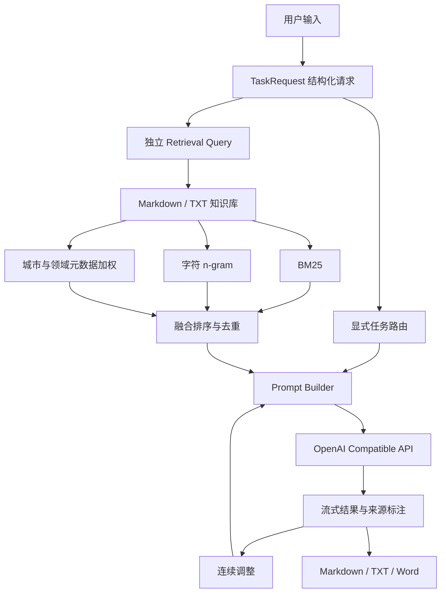

# 粤见非遗｜寻脉岭南，智游非遗

> 面向广东文旅导览、研学教育与文化传播的 AI Agent。系统将结构化用户需求、广东非遗知识检索和任务型生成流程组合起来，输出可出发、可学习、可发布的文化体验方案。

<p align="center">
  
</p>

<p align="center">
  
  
  
  
</p>

<p align="center">
  <a href="https://yuejian-feiyi-agent.streamlit.app/">在线体验</a> ·
  <a href="#核心能力">核心能力</a> ·
  <a href="#技术架构">技术架构</a> ·
  <a href="#快速开始">快速开始</a> ·
  <a href="#测试与评测">测试与评测</a>
</p>

---

## 项目简介

广东非遗资源丰富，但用户通常需要在搜索、路线规划、研学设计和内容创作之间反复切换。粤见非遗把这些步骤组合成一个任务工作流：

```text
结构化需求
→ 显式任务路由
→ 独立知识检索
→ 来源约束生成
→ 连续调整
→ Markdown / TXT / Word 导出
```

项目支持五类任务：

| 场景 | 主要输出 |
|---|---|
| 游客路线 | 文化路线、节点看点、体验建议、出发提醒 |
| 学生研学 | 学习目标、任务卡、采访问题、报告提纲 |
| 亲子体验 | 轻量路线、互动任务、休息与安全提醒 |
| 内容创作 | 标题、完整图文、配图建议、传播标签 |
| 非遗问答 | 通俗解释、文化背景、核心看点、体验方式 |

## 核心能力

### 1. 显式任务路由

Web 页面直接把用户选择的场景映射为 `route / study / social / video / qa`，不再根据拼装后的长 Prompt 猜任务类型。因此，“内容创作”不会因为模板中出现“短视频”而被错误路由到视频任务。

### 2. 独立检索查询

RAG 只读取用户原始需求、城市和兴趣词，不把网页排版规则、输出模板或上一轮 Prompt 混入检索查询。

### 3. 轻量混合检索

默认检索器组合：

- BM25 关键词相关性
- 中文字符 n-gram 相似度
- 城市、非遗项目与类别元数据加权
- 高相似片段去重
- Top-K 总字符预算控制

知识库支持 Markdown/TXT，并可在 Markdown 顶部加入元数据：

```yaml
---
title: 粤剧
city: 广州
category: 传统戏剧
source_name: 广东文化资料
source_url: https://example.com/source
---
```

### 4. 来源编号约束

检索片段以 `[S1]`、`[S2]` 等编号传给模型，Prompt 要求在使用知识库事实时标注来源。结果区可展开查看本次检索来源。

### 5. 连续优化不套娃

连续调整始终使用：

```text
最初需求 + 当前答案 + 本次修改要求
```

系统不会把上一轮完整 Prompt 当作新的用户需求保存，因此不会出现多轮修改后 Prompt 递归膨胀的问题。

### 6. 安全模型接入

- API Key 只保存在当前 Streamlit 会话
- 自定义 Base URL 必须使用 HTTPS
- 拒绝本机、内网、保留地址及带账号密码的 URL
- 支持服务器端域名允许列表
- 401、403、404、429、超时和连接错误分别提示
- 流式失败仅在“尚未返回任何文本”时回退普通生成，避免部分输出后再次计费

### 7. 多格式导出

结果可下载为 Markdown、TXT 和 Word `.docx`。

---

## 技术架构



## 项目结构

```text
Yuejian-Feiyi-Agent/
├── app.py                       # Streamlit 应用入口与流程编排
├── agent.py                     # 兼容旧版调用方式的公共 API
├── rag.py                       # 兼容旧版 RAG 导出
├── prompts.py                   # 兼容旧版 Prompt 导出
├── core/
│   ├── config.py                # 模型服务预设与配置构造
│   ├── models.py                # 领域模型
│   └── state.py                 # 会话状态和连续优化状态机
├── services/
│   ├── retrieval.py             # 混合检索、元数据、去重与来源编号
│   ├── prompt_builder.py        # 单一 Prompt 构造入口
│   ├── llm.py                   # 模型网关、安全校验、流式回退
│   ├── output.py                # 输出清洗
│   └── export.py                # Markdown / TXT / Word 导出
├── ui/                          # Streamlit 页面组件与样式
├── data/                        # 广东非遗知识库
├── evaluation/benchmark.json   # 基础评测样例
├── scripts/run_benchmark.py     # 路由与检索评测脚本
├── tests/                       # 单元测试
├── docs/                        # 架构、评测和知识库说明
└── .github/workflows/ci.yml     # Ruff、编译和 Pytest
```

---

## 快速开始

### 1. 克隆仓库

```bash
git clone https://github.com/liqinglq666/Yuejian-Feiyi-Agent.git
cd Yuejian-Feiyi-Agent
```

### 2. 创建虚拟环境

Windows：

```bash
python -m venv .venv
.venv\Scripts\activate
```

macOS / Linux：

```bash
python -m venv .venv
source .venv/bin/activate
```

### 3. 安装依赖

```bash
python -m pip install -r requirements.txt
```

开发环境：

```bash
python -m pip install -r requirements-dev.txt
```

### 4. 启动应用

```bash
python -m streamlit run app.py
```

浏览器访问 `http://localhost:8501`。

### 5. 配置模型

在侧边栏填写 API Key、Base URL 和模型名称，点击“测试模型连接”确认接口可用，再生成内容。

---

## 知识库维护

项目自动读取 `data/` 目录下的 `.md` 和 `.txt` 文件。推荐每个主题使用独立文档，并填写来源元数据。

知识库内容应：

- 优先引用政府、官方场馆、权威文化机构或公开名录
- 标注来源名称和链接
- 对开放时间、票价、活动排期等时效信息写明更新时间
- 不直接复制受版权保护的大段内容
- 区分事实资料与编辑者总结

详见 `docs/KNOWLEDGE_BASE.md`。

---

## 测试与评测

```bash
pytest
ruff check .
python -m compileall -q .
python scripts/run_benchmark.py
```

当前测试覆盖任务路由、关键词冲突、检索查询隔离、连续优化上下文、城市与项目排序、来源编号、模型网关安全和输出清洗。

Benchmark 文件只是可扩展起点，不在 README 中声明未经持续集成验证的准确率数字。

---

## 已知限制

- 当前检索器是无外部向量数据库的轻量混合检索，不等同于大型语义向量模型。
- 路线暂未接入地图、实时交通和 POI 营业数据，因此不会承诺精确通勤时间。
- 模型输出仍可能出现错误，重要文化事实应结合来源核验。
- 在线 Demo 需要用户提供兼容模型 API Key。
- Word 导出以可编辑文本为主，复杂 Markdown 表格不会完全复刻网页样式。

## 后续方向

- 接入地图与 POI API，校验路线顺序和地点距离
- 增加可选 Embedding 索引与离线向量缓存
- 建立更大规模的检索与事实性评测集
- 增加粤语讲解、语音导览和多模态识别

## 安全与贡献

- 安全问题请阅读 `SECURITY.md`
- 贡献流程请阅读 `CONTRIBUTING.md`
- 项目采用 Apache License 2.0，详见 `LICENSE`

> 得闲来玩，粤见非遗。让非遗从资料里走出来，进入每一次旅行、课堂与创作。
