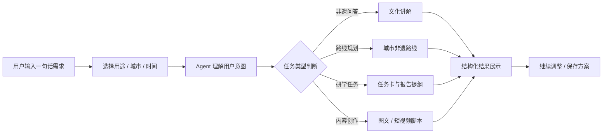
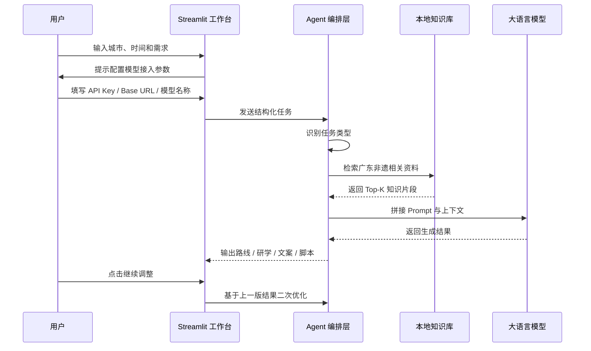
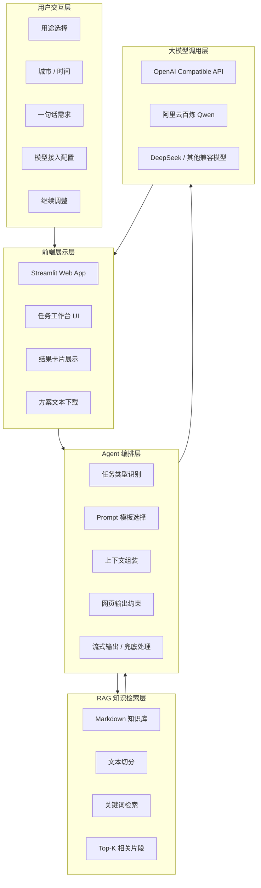
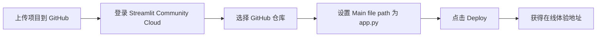
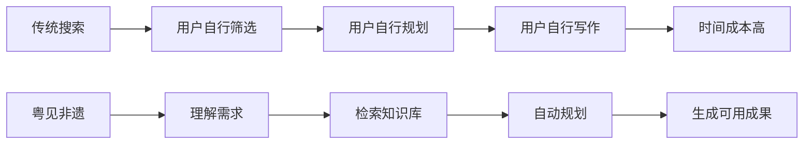
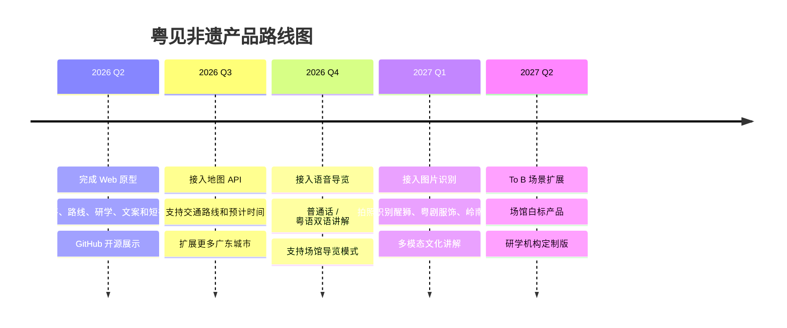

# 粤见非遗｜寻脉岭南，智游非遗

> **粤见非遗** 是一个面向广东文旅导览、研学教育与城市文化传播的 AI Agent。  
> 用户输入城市、时间、出行对象与兴趣，即可生成非遗路线、文化讲解、研学任务、短视频脚本与图文传播文案。

<p align="center">
  
</p>

<p align="center">
  
  
  
  
  
</p>

<p align="center">
  <a href="#在线体验">在线体验</a> ·
  <a href="https://github.com/liqinglq666/Yuejian-Feiyi-Agent">项目源码</a> ·
  <a href="#核心功能">核心功能</a> ·
  <a href="#技术架构">技术架构</a> ·
  <a href="#快速开始">快速开始</a> ·
  <a href="#部署说明">部署说明</a>
</p>

---

## 在线体验

> 项目支持本地运行与 Streamlit Cloud 在线部署。  
> 当前 README 已预留在线 Demo 位置，部署完成后将下面链接替换为你的真实访问地址即可。

```text
在线 Demo：部署后填写，例如 https://yuejian-feiyi.streamlit.app/
代码仓库：https://github.com/liqinglq666/Yuejian-Feiyi-Agent
```

### 体验说明

本项目采用 **用户侧模型接入** 方式。在线体验时，用户需要在页面左侧「模型接入」中配置 OpenAI 兼容模型服务：

- API Key
- Base URL
- 模型名称

API Key 仅用于当前会话中的模型调用，不会写入项目文件，也不会提交到公开仓库。

---

## 项目简介

**粤见非遗** 是一个基于大语言模型、RAG 本地知识库与任务型 Prompt 编排的广东非遗文化体验工作台。

它不是一个单纯的“问答机器人”，而是一个面向真实文旅场景的 **AI 文化服务工作流引擎**。系统能够理解用户的城市、时间、身份和兴趣，并自动生成可执行的文化路线、研学任务、非遗讲解、图文文案和短视频脚本。

项目希望解决一个实际问题：

> 广东非遗资源丰富，但普通用户往往不知道“看什么、怎么走、怎么学、怎么传播”。  
> 粤见非遗把分散的文化资料转化为可以直接出发、记录、创作和分享的方案。

---

## 项目定位

```text
粤见非遗
= 广东非遗知识库
+ RAG 检索增强
+ AI Agent 任务编排
+ 文旅导览
+ 研学教育
+ 内容创作
```

| 维度 | 内容 |
|---|---|
| 产品名称 | 粤见非遗 |
| Slogan | 寻脉岭南，智游非遗 |
| 产品类型 | 广东非遗体验工作台 / 文化导游智能体 |
| 目标用户 | 游客、学生、亲子家庭、内容创作者、文旅/场馆机构 |
| 核心能力 | 非遗问答、路线规划、研学任务、图文文案、短视频脚本 |
| 技术路线 | Streamlit + OpenAI Compatible API + RAG + Prompt Engineering |
| 使用闭环 | 问、走、学、写、发 |
| 文化主题 | 广东非遗、岭南文化、城市文旅、研学教育、文化传播 |

---

## 痛点与解决方案

广东拥有丰富的岭南文化资源和非遗项目，例如粤剧、醒狮、广绣、龙舟、潮汕工夫茶、佛山陶塑、潮汕英歌舞、香云纱、客家山歌等。但在真实使用中，用户经常面临以下问题：

| 传统文旅痛点 | 用户真实困境 | 粤见非遗的解决方案 |
|---|---|---|
| 信息碎片化 | 用户需要在搜索引擎、攻略平台、公众号、场馆页面之间来回切换 | 通过本地 RAG 知识库整合广东非遗资料，生成结构化文化讲解 |
| 体验流于表面 | 用户不知道看什么、怎么走、怎么看，容易只停留在拍照打卡 | 根据城市、时间、身份和兴趣生成路线、文化看点与观察建议 |
| 研学难落地 | 学生缺少任务卡、观察表和报告提纲 | 自动生成研学主题、现场任务、采访问题和报告结构 |
| 内容转化困难 | 创作者缺少标题、脚本、文案和拍摄思路 | 自动生成小红书文案、短视频分镜、旁白、标签和配图建议 |
| 个性化不足 | 同一份攻略无法适配游客、学生、亲子和创作者 | Agent 根据用途和场景动态调整输出结构与表达方式 |

---

## 核心功能

### 1. 非遗知识问答引擎

围绕广东非遗项目进行通俗化、场景化解释，支持游客版、学生版和创作者版表达。

可回答：

- 醒狮、粤剧、广绣分别代表什么文化？
- 潮汕英歌舞为什么有这么强的视觉冲击力？
- 陈家祠的灰塑、木雕、砖雕应该怎么看？
- 广东非遗适合如何做研学记录？

### 2. 场景化路线规划中枢

根据城市、时间、身份和兴趣，生成半天、一日或周末非遗体验路线。

可生成：

- 路线主题
- 时间安排
- 每站文化看点
- 拍照与记录建议
- 出发前提醒

### 3. 一站式研学工作流

面向学生、学校研学、亲子研学和大学生调研，生成完整研学任务。

可生成：

- 研学主题
- 学习目标
- 行前准备
- 现场任务卡
- 采访问题
- 报告提纲

### 4. 跨平台传播内容矩阵

将线下文化体验转化为线上可发布的数字文化内容。

可生成：

- 小红书标题和正文
- 朋友圈/公众号文案
- 60 秒短视频脚本
- 镜头分镜
- 旁白字幕
- 配图建议与话题标签

---

## 产品使用流程



---

## Agent 工作流



---

## 技术架构



---

## 项目结构

```text
Yuejian-Feiyi-Agent/
├── app.py                    # Streamlit 前端页面与交互逻辑
├── agent.py                  # 模型调用、任务识别与流式输出
├── rag.py                    # 本地知识库读取、切分与检索
├── prompts.py                # 系统 Prompt 与任务 Prompt 模板
├── requirements.txt          # Python 依赖
├── README.md                 # 项目说明文档
├── .env.example              # 环境变量示例，不包含真实密钥
├── .gitignore                # Git 忽略规则
├── .streamlit/
│   └── config.toml           # Streamlit 页面配置
├── assets/                   # 页面图片与视觉素材
├── data/                     # 广东非遗知识库
└── docs/                     # 比赛文档、技术说明与补充材料
```

---

## 快速开始

### 1. 克隆项目

```bash
git clone https://github.com/liqinglq666/Yuejian-Feiyi-Agent.git
cd Yuejian-Feiyi-Agent
```

### 2. 创建虚拟环境

Windows：

```bash
python -m venv venv
venv\Scripts\activate
```

macOS / Linux：

```bash
python -m venv venv
source venv/bin/activate
```

### 3. 安装依赖

```bash
python -m pip install -r requirements.txt
```

如果国内网络较慢，可以使用清华源：

```bash
python -m pip install -r requirements.txt -i https://pypi.tuna.tsinghua.edu.cn/simple
```

### 4. 启动应用

```bash
python -m streamlit run app.py
```

启动后浏览器访问：

```text
http://localhost:8501
```

### 5. 配置模型接入

在页面左侧「模型接入」中填写：

```text
API Key
Base URL
模型名称
```

常用配置示例：

阿里云百炼 Qwen：

```text
Base URL: https://dashscope.aliyuncs.com/compatible-mode/v1
模型名称: qwen-turbo
```

DeepSeek：

```text
Base URL: https://api.deepseek.com
模型名称: deepseek-chat
```

---

## 模型接口说明

项目使用 OpenAI Compatible API 格式，因此可以接入多种兼容模型服务。

| 服务 | Base URL | 模型示例 |
|---|---|---|
| 阿里云百炼 Qwen | `https://dashscope.aliyuncs.com/compatible-mode/v1` | `qwen-turbo` / `qwen-plus` / `qwen-max` |
| DeepSeek | `https://api.deepseek.com` | `deepseek-chat` |
| 自定义 OpenAI 兼容接口 | 用户自行填写 | 用户自行填写 |

说明：

- 页面不会内置公共 API Key。
- 用户输入的 API Key 仅用于当前会话调用。
- 项目不会把 API Key 写入本地文件、代码仓库或知识库。
- 如果部署者希望提供免配置体验，可自行在代码中扩展平台侧模型接入模式。

---

## 部署说明

### Streamlit Cloud 部署

1. 将项目上传到 GitHub。
2. 打开 Streamlit Community Cloud。
3. 选择仓库：`liqinglq666/Yuejian-Feiyi-Agent`
4. 选择分支：`main`
5. 设置入口文件：`app.py`
6. 点击 Deploy。
7. 部署完成后复制生成的 `streamlit.app` 地址。

部署流程：



### Secrets 配置说明

当前版本采用用户侧模型接入方式，部署到 Streamlit Cloud 时可以不配置模型 API Secrets。  
用户访问页面后，在侧边栏「模型接入」中填写自己的模型服务参数即可使用。

---

## 典型演示案例

### 示例一：广州一日非遗路线

```text
我第一次来广州，有一天时间，想体验岭南非遗文化，最好适合拍照和写研学记录。
```

系统可生成：

- 广州一日非遗文化路线
- 每站文化看点
- 拍照建议
- 研学观察任务
- 后续可转成小红书文案或短视频脚本

### 示例二：高中研学任务

```text
我是高中生，要做一份广东非遗研学报告，请帮我设计任务卡，主题围绕粤剧、醒狮和广绣。
```

系统可生成：

- 研学主题
- 学习目标
- 现场观察任务
- 采访问题
- 报告提纲

### 示例三：潮汕英歌舞短视频脚本

```text
帮我写一条介绍潮汕英歌舞的 60 秒短视频脚本，风格有画面感，适合抖音发布。
```

系统可生成：

- 视频主题
- 开头钩子
- 60 秒分镜脚本
- 旁白字幕
- 拍摄建议
- 标题与标签

---

## 创新价值

### 1. 从“搜索信息”升级为“完成任务”



### 2. 从“静态非遗资料”升级为“动态文化服务”

系统不是简单展示非遗资料，而是将知识转换为路线、任务、脚本和文案。

### 3. 从“通用大模型”升级为“广东文化增强模型应用”

通过本地 RAG 和广东非遗知识库，减少泛化回答，让输出更贴近岭南文化场景。

### 4. 从“单次生成”升级为“持续调整”

用户生成方案后，还可以继续一键调整为：

- 半天路线
- 亲子友好版
- 小红书文案
- 短视频脚本
- 研学记录表

---

## 应用场景

| 场景 | 使用方式 | 输出成果 |
|---|---|---|
| 游客出行 | 输入城市、时间和兴趣 | 非遗路线、文化看点、出发提醒 |
| 学生研学 | 输入研学主题和对象 | 任务卡、采访问题、报告提纲 |
| 亲子体验 | 输入孩子年龄、城市和节奏偏好 | 轻松路线、互动任务、安全提醒 |
| 内容创作 | 输入非遗主题和发布平台 | 标题、文案、分镜脚本、标签 |
| 文旅机构 | 作为场馆导览和内容生产工具 | 定制讲解、活动文案、传播素材 |

---

## 安全说明

请不要将 `.env` 或 `.streamlit/secrets.toml` 上传到 GitHub。

建议 `.gitignore` 至少包含：

```gitignore
.env
.env.*
!.env.example
.streamlit/secrets.toml
__pycache__/
*.pyc
*.pyo
*.pyd
.DS_Store
Thumbs.db
venv/
.venv/
env/
.vscode/
.idea/
*.log
*.tmp
*.zip
*.bak
```

如果 `.env` 已经被 Git 跟踪，请执行：

```bash
git rm --cached .env
```

然后重新提交。

---

## 未来规划



---

## 致谢

感谢广东丰富的岭南文化与非遗资源为本项目提供灵感。  
愿更多人通过 AI 走近非遗、理解非遗、传播非遗。

> 得闲来玩，粤见非遗。  
> 让非遗从资料里走出来，进入每一次旅行、课堂与创作。
