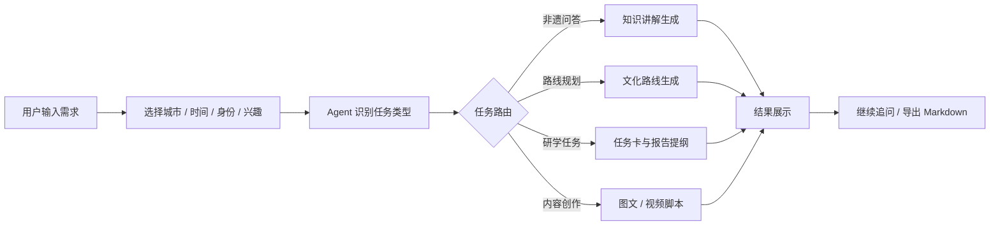
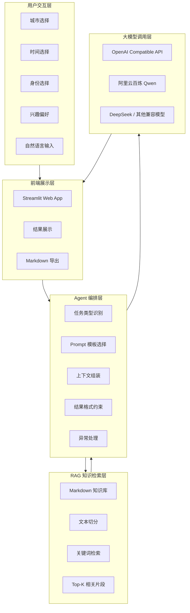
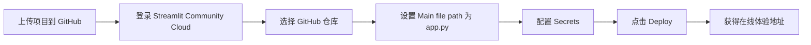
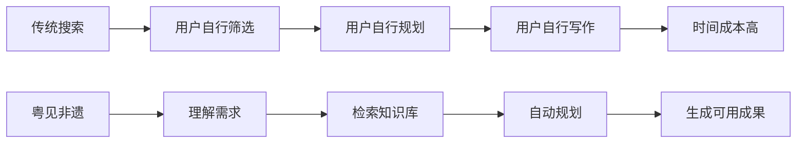
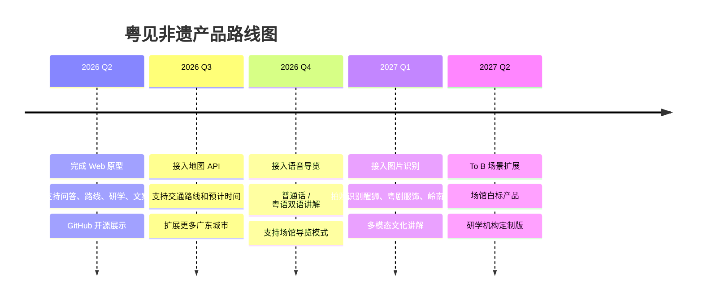

# 粤见非遗｜寻脉岭南，智游非遗

> 面向广东文旅导览、研学教育与城市文化传播的 AI 智能体。
> 输入城市、时间、身份与兴趣，即可生成非遗路线、文化讲解、研学任务、短视频脚本与图文传播文案。

<p align="center">
  
</p>

<p align="center">
  
  
  
  
  
</p>

<p align="center">
  <a href="你的在线体验地址">在线体验</a> ·
  <a href="你的 GitHub 地址">项目源码</a> ·
  <a href="#快速开始">快速开始</a> ·
  <a href="#技术架构">技术架构</a> ·
  <a href="#项目结构">项目结构</a>
</p>

---

## 项目简介

**粤见非遗** 是一个基于大语言模型、RAG 本地知识库与任务型 Prompt 编排的广东非遗文化导游智能体。

它不是一个单纯的问答机器人，而是一个面向真实文旅场景的 **AI 文化服务工作流引擎**。系统能够理解用户的城市、时间、身份与兴趣，并自动生成可执行的文化路线、研学任务、文化讲解和传播内容。

> 让非遗从“资料里”走出来，进入每一次旅行、课堂与创作。

---

## 项目定位

```text
粤见非遗 = 广东非遗知识库 + RAG 检索增强 + AI Agent 工作流 + 文旅导览 + 研学教育 + 内容创作
```

| 维度     | 内容                                                           |
| ------ | ------------------------------------------------------------ |
| 产品名称   | 粤见非遗                                                         |
| Slogan | 寻脉岭南，智游非遗                                                    |
| 产品类型   | 广东非遗文化导游智能体                                                  |
| 核心用户   | 游客、学生、亲子家庭、内容创作者、文旅/场馆机构                                     |
| 核心能力   | 非遗问答、路线规划、研学任务、图文文案、短视频脚本                                    |
| 技术路线   | Streamlit + OpenAI Compatible API + RAG + Prompt Engineering |
| 核心闭环   | 问、走、学、写、发                                                    |
| 文化主题   | 广东非遗、岭南文化、城市文旅、研学教育、文化传播                                     |

---

## 痛点与解决方案

广东拥有丰富的岭南文化资源和非遗项目，例如粤剧、醒狮、广绣、龙舟、潮汕工夫茶、佛山陶塑、潮汕英歌舞、客家围龙屋、香云纱等。

| 传统文旅痛点   | 用户真实困境                        | 粤见非遗的 AI 解决方案                  |
| -------- | ----------------------------- | ------------------------------ |
| 信息碎片化    | 用户需要在搜索引擎、攻略平台、公众号、场馆信息之间来回切换 | 通过本地 RAG 知识库整合广东非遗知识，生成结构化文化讲解 |
| 体验流于表面   | 用户不知道看什么、怎么走、怎么看，容易只停留在拍照打卡   | 根据城市、时间、身份和兴趣生成可执行路线、文化看点和观察建议 |
| 内容转化困难   | 学生缺任务卡，创作者缺脚本和文案，文化资料难以转化为成果  | 自动生成研学任务、报告提纲、小红书文案和短视频脚本      |
| 个性化不足    | 同一份攻略无法适配游客、学生、亲子和创作者         | Agent 根据身份和任务类型动态调整输出结构与表达方式   |
| 文化表达不够在地 | 通用旅游内容容易泛化，缺少岭南文化细节           | 围绕广东非遗、广府文化、潮汕文化、客家文化组织知识底座    |

---

## 核心功能

### 1. 非遗知识问答引擎

围绕广东非遗项目进行通俗化、场景化解释，支持游客版、学生版和创作者版表达。

### 2. 场景化路线规划中枢

根据用户输入的城市、时间、身份和兴趣，生成半天、一日或周末非遗体验路线。

### 3. 一站式研学工作流

面向学生、学校研学、亲子研学和大学生调研，生成完整研学任务。

### 4. 跨平台传播内容矩阵

将线下文化体验转化为线上可发布的数字文化资产。

---

## 产品使用流程



---

## 技术架构



---

## 项目结构

```text
Yuejian-Feiyi-Agent/
├── app.py
├── agent.py
├── rag.py
├── prompts.py
├── requirements.txt
├── README.md
├── .env.example
├── .gitignore
├── .streamlit/
│   └── config.toml
├── assets/
├── data/
└── docs/
```

---

## 快速开始

### 1. 克隆项目

```bash
git clone https://github.com/你的用户名/Yuejian-Feiyi-Agent.git
cd Yuejian-Feiyi-Agent
```

### 2. 创建虚拟环境

Windows：

```bash
python -m venv venv
venv\Scripts\activate
```

macOS / Linux：

```bash
python -m venv venv
source venv/bin/activate
```

### 3. 安装依赖

```bash
python -m pip install -r requirements.txt -i https://pypi.tuna.tsinghua.edu.cn/simple
```

### 4. 配置 API

复制 `.env.example` 为 `.env`。

Windows：

```bash
copy .env.example .env
```

macOS / Linux：

```bash
cp .env.example .env
```

然后编辑 `.env`：

```env
OPENAI_API_KEY=你的API_KEY
OPENAI_BASE_URL=https://dashscope.aliyuncs.com/compatible-mode/v1
MODEL_NAME=qwen-plus
```

### 5. 启动应用

```bash
python -m streamlit run app.py
```

启动后浏览器访问：

```text
http://localhost:8501
```

---

## 模型接口配置

### 阿里云百炼 Qwen

```env
OPENAI_API_KEY=你的阿里云百炼API_KEY
OPENAI_BASE_URL=https://dashscope.aliyuncs.com/compatible-mode/v1
MODEL_NAME=qwen-plus
```

### DeepSeek

```env
OPENAI_API_KEY=你的DeepSeek_API_KEY
OPENAI_BASE_URL=https://api.deepseek.com
MODEL_NAME=deepseek-chat
```

---

## Streamlit Cloud 部署

部署到 Streamlit Cloud 时，请不要上传 `.env` 文件。

需要在 Streamlit Cloud 的 **Secrets** 中配置：

```toml
OPENAI_API_KEY = "你的API_KEY"
OPENAI_BASE_URL = "https://dashscope.aliyuncs.com/compatible-mode/v1"
MODEL_NAME = "qwen-plus"
```



---

## 典型演示案例

### 示例一：广州一日非遗路线

```text
我第一次来广州，有一天时间，想体验岭南非遗文化，最好适合拍照和写研学记录。
```

系统可生成：

* 广州一日非遗文化路线
* 每站文化看点
* 拍照建议
* 研学观察任务
* 小红书文案或短视频脚本

### 示例二：高中研学任务

```text
我是高中生，要做一份广东非遗研学报告，请帮我设计任务卡，主题围绕粤剧、醒狮和广绣。
```

### 示例三：潮汕英歌舞短视频脚本

```text
帮我写一条介绍潮汕英歌舞的 60 秒短视频脚本，风格有画面感，适合抖音发布。
```

---

## 创新价值

### 1. 从“搜索信息”升级为“完成任务”



### 2. 从“静态非遗资料”升级为“动态文化服务”

系统不是简单展示非遗资料，而是将知识转换为路线、任务、脚本和文案。

### 3. 从“通用大模型”升级为“广东文化增强模型应用”

通过本地 RAG 和广东非遗知识库，减少泛化回答，让输出更贴近岭南文化场景。

---

## 未来规划



---

## 安全说明

请不要将 `.env` 上传到 GitHub。

建议 `.gitignore` 包含：

```gitignore
.env
.streamlit/secrets.toml
__pycache__/
*.pyc
.DS_Store
venv/
.venv/
```

---

## 致谢

感谢广东丰富的岭南文化与非遗资源为本项目提供灵感。
愿更多人通过 AI 走近非遗、理解非遗、传播非遗。

> 得闲来玩，粤见非遗。
> ::: 
