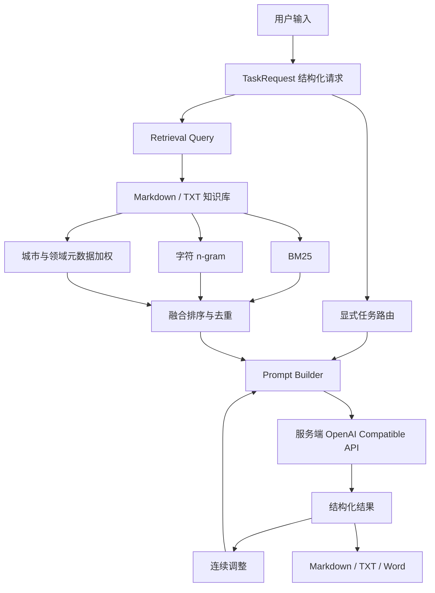

# 粤见非遗｜寻脉岭南，智游非遗

> 面向广东文旅导览、研学教育与文化传播的 AI Agent。系统将结构化用户需求、广东非遗知识检索和任务型生成流程组合起来，输出可出发、可学习、可发布的文化体验方案。

<p align="center">
  <a href="https://yuejian-feiyi-agent.streamlit.app/">
    
  </a>
</p>

<p align="center"><strong>点击上方图片，直接打开粤见非遗在线网页</strong></p>

<p align="center">
  
  
  
  
</p>

<p align="center">
  <a href="https://yuejian-feiyi-agent.streamlit.app/">在线体验</a> ·
  <a href="#核心能力">核心能力</a> ·
  <a href="#技术架构">技术架构</a> ·
  <a href="#快速开始">快速开始</a> ·
  <a href="#测试与评测">测试与评测</a>
</p>

---

## 项目简介

广东非遗资源丰富，但用户通常需要在搜索、路线规划、研学设计和内容创作之间反复切换。粤见非遗把这些步骤组合成一个任务工作流：

```text
结构化需求
→ 显式任务路由
→ 独立知识检索
→ 知识约束生成
→ 连续调整
→ Markdown / TXT / Word 导出
```

项目支持五类任务：

| 场景 | 主要输出 |
|---|---|
| 游客路线 | 文化路线、节点看点、体验建议、出发提醒 |
| 学生研学 | 学习目标、任务卡、采访问题、报告提纲 |
| 亲子体验 | 轻量路线、互动任务、休息与安全提醒 |
| 内容创作 | 标题、完整图文、配图建议、传播标签 |
| 非遗问答 | 通俗解释、文化背景、核心看点、体验方式 |

## 核心能力

### 1. 显式任务路由

Web 页面直接把用户选择的场景映射为 `route / study / social / video / qa`，不依赖长 Prompt 猜任务类型。

### 2. 独立检索查询

首次生成时，RAG 主要使用用户原始需求、城市和兴趣等知识相关字段；继续调整时只补充本轮修改要求，不把完整历史 Prompt 递归加入检索。

### 3. 轻量混合检索

默认检索器组合：

- BM25 关键词相关性
- 中文字符 n-gram 相似度
- 城市与领域元数据加权
- 高相似片段去重
- Top-K 总字符预算控制

知识库支持 Markdown / TXT，并可在 Markdown 顶部加入元数据：

```yaml
---
title: 粤剧
city: 广州
category: 传统戏剧
source_name: 来源机构
source_url: https://example.com/source
---
```

### 4. 知识约束生成

检索结果作为模型生成的知识上下文。系统要求模型只把检索资料中明确出现的信息当作已核验事实；开放时间、票价、预约、演出和交通等实时信息必须提醒用户以官方平台为准。

面向用户的结果不显示 RAG 内部来源编号或类似 `[S1]`、`[S2]` 的技术标记。

### 5. 连续优化

连续调整始终围绕：

```text
最初需求 + 当前答案 + 本次修改要求
```

系统不会把上一轮完整 Prompt 当作新的用户需求保存，避免多轮修改后上下文递归膨胀。

### 6. 服务端统一模型接入

- API Key、Base URL 和模型名称仅由项目维护者在服务端部署环境中配置
- 网页端不提供 API Key、模型服务商、Base URL 或模型名称输入框
- 用户无法通过页面把请求转发到任意自定义模型网关
- 模型服务地址默认要求 HTTPS，并拒绝本机、内网、保留地址及带账号密码的 URL
- 生产环境可使用 `LLM_ALLOWED_HOSTS` 限制服务端允许访问的模型域名
- 401、403、404、429、超时和连接错误会转换为不泄露密钥与内部配置的用户提示
- 流式失败仅在尚未返回任何文本时回退普通生成，避免部分输出后再次计费

### 7. 多格式导出

结果可下载为 Markdown、TXT 和 Word `.docx`。

---

## 技术架构


```mermaid
flowchart TB
    U[用户输入] --> RQ[TaskRequest 结构化请求]
    RQ --> RT[显式任务路由]
    RQ --> Q[Retrieval Query]
    Q --> KB[Markdown / TXT 知识库]
    KB --> BM[BM25]
    KB --> NG[字符 n-gram]
    KB --> MB[城市与领域元数据加权]
    BM --> RR[融合排序与去重]
    NG --> RR
    MB --> RR
    RT --> PB[Prompt Builder]
    RR --> PB
    PB --> LLM[服务端 OpenAI Compatible API]
    LLM --> OUT[结构化结果]
    OUT --> REV[连续调整]
    OUT --> EXP[Markdown / TXT / Word]
    REV --> PB
```

## 项目结构

```text
Yuejian-Feiyi-Agent/
├── app.py                       # Streamlit 应用入口与流程编排
├── core/                        # 领域模型、服务端配置、状态与调整逻辑
├── services/                    # 检索、Prompt、模型网关、输出与导出
├── ui/                          # Streamlit 页面组件与样式
├── data/                        # 广东非遗知识库
├── evaluation/benchmark.json   # 基础评测样例
├── scripts/run_benchmark.py     # 路由与检索评测脚本
├── tests/                       # 单元测试
├── docs/                        # 架构、评测与知识库说明
├── agent.py                     # 兼容旧版公共调用入口
├── rag.py                       # 兼容旧版 RAG 入口
├── prompts.py                   # 兼容旧版 Prompt 导出
└── .github/workflows/ci.yml     # Ruff、编译和 Pytest
```

---

## 快速开始

### 1. 克隆仓库

```bash
git clone https://github.com/liqinglq666/Yuejian-Feiyi-Agent.git
cd Yuejian-Feiyi-Agent
```

### 2. 创建虚拟环境

Windows：

```bash
python -m venv .venv
.venv\Scripts\activate
```

macOS / Linux：

```bash
python -m venv .venv
source .venv/bin/activate
```

### 3. 安装依赖

```bash
python -m pip install -r requirements.txt
```

开发环境：

```bash
python -m pip install -r requirements-dev.txt
```

### 4. 配置服务端模型

复制 `.env.example` 为 `.env`，只在服务端填写真实配置：

```env
OPENAI_API_KEY=your_server_api_key_here
OPENAI_BASE_URL=https://dashscope.aliyuncs.com/compatible-mode/v1
MODEL_NAME=qwen-turbo
LLM_ALLOWED_HOSTS=dashscope.aliyuncs.com
```

如果使用 Streamlit Community Cloud，可把同名键写入项目 Secrets；不要把 `.env` 或 `.streamlit/secrets.toml` 提交到 Git。

### 5. 启动应用

```bash
python -m streamlit run app.py
```

浏览器访问 `http://localhost:8501`。终端用户无需也不能在网页中配置 API Key。

---

## 知识库维护

项目自动读取 `data/` 目录下的 `.md` 和 `.txt` 文件。推荐为知识主题填写清晰的标题、城市、类别与来源元数据。

知识库内容应：

- 优先使用政府、官方场馆、权威文化机构或公开名录资料
- 标注来源名称和链接
- 对开放时间、票价、活动排期等时效信息写明更新时间
- 不直接复制受版权保护的大段内容
- 区分事实资料与编辑者总结

详见 `docs/KNOWLEDGE_BASE.md`。

---

## 测试与评测

```bash
pytest
ruff check .
python -m compileall -q .
python scripts/run_benchmark.py
```

当前测试覆盖任务路由、检索查询、连续优化、城市与项目排序、服务端模型配置、模型网关安全、输出清洗和主要状态逻辑。

Benchmark 是可扩展的基础评测集，不在 README 中声明未经持续验证的准确率数字。

---

## 已知限制

- 当前检索器是无外部向量数据库的轻量混合检索，不等同于大型语义向量模型。
- 路线暂未接入地图、实时交通和 POI 营业数据，因此不会承诺精确通勤时间。
- 模型输出仍可能出现错误，重要文化事实应结合官方资料核验。
- 公网部署使用服务端统一 API Key 时，应在托管平台、反向代理或 API 网关增加访问控制、限流和预算告警，避免匿名滥用产生费用。
- Word 导出以可编辑文本为主，复杂 Markdown 表格不会完全复刻网页样式。

## 文档

- `docs/ARCHITECTURE.md`：当前系统架构与请求生命周期
- `docs/KNOWLEDGE_BASE.md`：知识库编写与维护规范
- `docs/EVALUATION.md`：测试与评测说明

## 安全与贡献

- 安全问题请阅读 `SECURITY.md`
- 贡献流程请阅读 `CONTRIBUTING.md`
- 项目采用 Apache License 2.0，详见 `LICENSE`

> 得闲来玩，粤见非遗。让非遗从资料里走出来，进入每一次旅行、课堂与创作。
