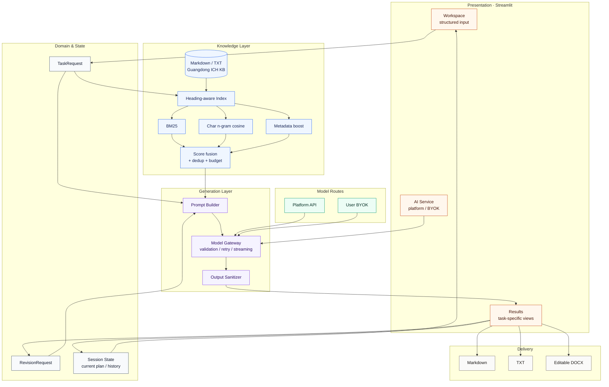
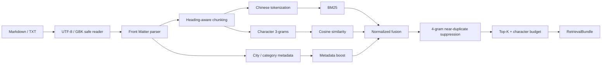
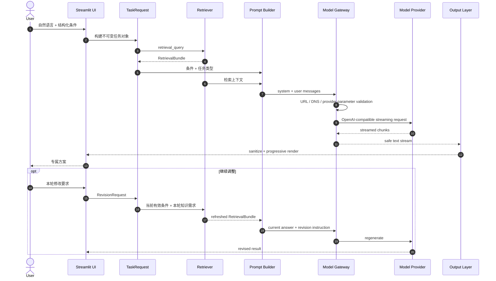
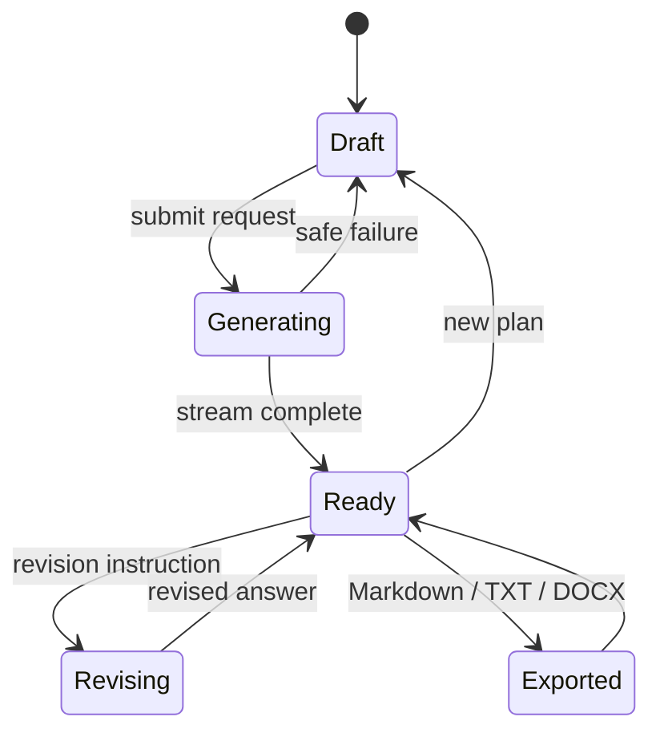
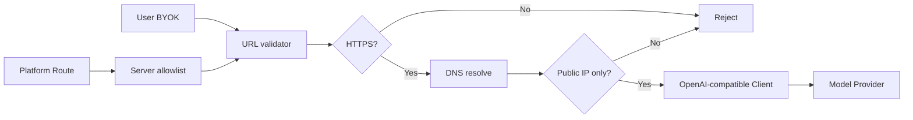

<div align="center">

<a href="https://yuejian-feiyi-agent.streamlit.app/">
  
</a>

<br/>
<br/>

# 粤见非遗 · Yuejian Intangible Heritage Agent

### 寻脉岭南，智游非遗

**A structured AI workspace for Guangdong intangible cultural heritage — built for travel, study and cultural storytelling.**

<br/>

[](https://yuejian-feiyi-agent.streamlit.app/)
[](https://github.com/liqinglq666/Yuejian-Feiyi-Agent/actions/workflows/ci.yml)


<br/>

[在线体验](https://yuejian-feiyi-agent.streamlit.app/) · [系统架构](#03--architecture--系统架构) · [检索引擎](#04--retrieval-engine--检索引擎) · [快速开始](#09--quick-start--快速开始) · [工程质量](#10--engineering-quality--工程质量)

</div>

---

## 01 · Overview / 项目定位

**粤见非遗**不是一个把“广东非遗”塞进系统提示词里的通用聊天机器人，而是一套围绕真实任务设计的文化体验工作台。

它将用户的自然语言需求转换为结构化任务，再通过本地知识检索、任务专属 Prompt、模型网关与可持续修订状态，输出可以直接用于旅行、研学、内容创作和文化理解的结果。

```text
User Intent
   ↓
Structured TaskRequest
   ↓
Explicit Task Routing
   ↓
Local Hybrid Retrieval
   ↓
Knowledge-bounded Prompt
   ↓
OpenAI-compatible Model Gateway
   ↓
Streaming Structured Output
   ↓
Revision / Export / Reuse
```

> [!IMPORTANT]
> 项目的核心设计原则是 **“显式结构优先于隐式猜测，知识检索优先于自由补全，用户体验优先于工程信息暴露”**。

### Product principles

| Principle | Implementation |
|---|---|
| **Explicit over implicit** | 场景直接映射 `route / study / social / video / qa`，不依赖长 Prompt 猜任务类型 |
| **Retrieval before generation** | 先构造知识查询，再将检索结果注入模型上下文 |
| **Local-first knowledge layer** | Markdown / TXT 本地知识库，无外部向量数据库依赖 |
| **User-controlled model spend** | 自动模式不会静默消耗用户自己的 BYOK 额度 |
| **Product UI, engineering backend** | 普通用户不看到模型名、思考模式、首字延迟、Build ID 等诊断信息 |
| **Safe failure** | 模型错误经过安全映射；确定性失败不重复发起无意义请求 |

---

## 02 · Capability Matrix / 能力矩阵

| 场景 | Task Type | 典型输入 | 主要输出 |
|---|---:|---|---|
| 游客路线 | `route` | “第一次来广州，一天体验岭南非遗” | 路线、节点看点、体验建议、出发提醒 |
| 学生研学 | `study` | “高中生做粤剧、醒狮、广绣研学” | 学习目标、任务卡、采访问题、报告框架 |
| 亲子体验 | `route` | “半天亲子非遗体验，不要太累” | 轻量路线、互动任务、休息与安全提醒 |
| 内容创作 | `social` | “把体验写成小红书图文” | 标题、正文、配图建议、传播标签 |
| 短视频脚本 | `video` | “把当前方案改成 60 秒短视频” | 镜头、旁白、节奏、结尾引导 |
| 非遗问答 | `qa` | “醒狮为什么分南狮和北狮？” | 通俗解释、文化背景、核心看点、体验建议 |

### Structured request contract

用户输入最终被收敛到一个明确的数据模型，而不是直接把整个表单拼成一条不可控 Prompt。

```json
{
  "scene": "学生研学",
  "raw_request": "我是高中生，要做一份广东非遗研学报告，请围绕粤剧、醒狮和广绣设计任务卡。",
  "city": "广州",
  "duration": "一天",
  "identity": "高中生",
  "interests": ["粤剧", "醒狮", "广绣"],
  "output_style": "研学报告",
  "task_type": "study"
}
```

显式城市选择还会覆盖自由文本中冲突的广东城市名，避免用户把“广州”改成“佛山”后，检索查询仍同时命中两个城市。

---

## 03 · Architecture / 系统架构


```mermaid
flowchart TB
    classDef ui fill:#FFF7ED,stroke:#C2410C,color:#431407,stroke-width:1px;
    classDef domain fill:#F8FAFC,stroke:#475569,color:#0F172A,stroke-width:1px;
    classDef rag fill:#EFF6FF,stroke:#2563EB,color:#172554,stroke-width:1px;
    classDef gen fill:#F5F3FF,stroke:#7C3AED,color:#2E1065,stroke-width:1px;
    classDef model fill:#ECFDF5,stroke:#059669,color:#022C22,stroke-width:1px;
    classDef out fill:#FAFAF9,stroke:#78716C,color:#1C1917,stroke-width:1px;

    subgraph UI["Presentation · Streamlit"]
        WS["Workspace\nstructured input"]:::ui
        SB["AI Service\nplatform / BYOK"]:::ui
        RS["Results\ntask-specific views"]:::ui
    end

    subgraph DOMAIN["Domain & State"]
        TR["TaskRequest"]:::domain
        RV["RevisionRequest"]:::domain
        ST["Session State\ncurrent plan / history"]:::domain
    end

    subgraph KNOWLEDGE["Knowledge Layer"]
        KB[("Markdown / TXT\nGuangdong ICH KB")]:::rag
        IX["Heading-aware Index"]:::rag
        BM["BM25"]:::rag
        NG["Char n-gram cosine"]:::rag
        MB["Metadata boost"]:::rag
        FU["Score fusion\n+ dedup + budget"]:::rag
    end

    subgraph GENERATION["Generation Layer"]
        PB["Prompt Builder"]:::gen
        GW["Model Gateway\nvalidation / retry / streaming"]:::gen
        CL["Output Sanitizer"]:::gen
    end

    subgraph PROVIDERS["Model Routes"]
        PA["Platform API"]:::model
        BY["User BYOK"]:::model
    end

    subgraph OUTPUT["Delivery"]
        MD["Markdown"]:::out
        TX["TXT"]:::out
        DX["Editable DOCX"]:::out
    end

    WS --> TR
    TR --> IX
    KB --> IX
    IX --> BM
    IX --> NG
    IX --> MB
    BM --> FU
    NG --> FU
    MB --> FU
    TR --> PB
    FU --> PB
    SB --> GW
    PB --> GW
    PA --> GW
    BY --> GW
    GW --> CL
    CL --> RS
    RS --> RV
    RV --> PB
    RS --> ST
    ST --> WS
    RS --> MD
    RS --> TX
    RS --> DX
```

### Layer responsibilities

```text
ui/          → presentation, interaction, task-specific rendering
core/        → immutable domain models, config routing, revision semantics, state
services/    → retrieval, prompt assembly, LLM gateway, output cleaning, export
 data/       → knowledge corpus with optional front matter metadata
 tests/      → regression, security, routing, retrieval, export and UI checks
```

这种分层使 UI、知识库和模型提供商可以分别演进，而不用把所有逻辑耦合在 `app.py` 中。

---

## 04 · Retrieval Engine / 检索引擎

项目没有为了“看起来像 RAG”而引入不必要的向量数据库。当前知识规模下，检索器采用一个可解释、可测试、无额外外部服务依赖的本地混合排序器。


```mermaid
flowchart LR
    A["Markdown / TXT"] --> B["UTF-8 / GBK safe reader"]
    B --> C["Front Matter parser"]
    C --> D["Heading-aware chunking"]
    D --> E["Chinese tokenization"]
    D --> F["Character 3-grams"]
    C --> G["City / category metadata"]

    E --> H["BM25"]
    F --> I["Cosine similarity"]
    G --> J["Metadata boost"]

    H --> K["Normalized fusion"]
    I --> K
    J --> K
    K --> L["4-gram near-duplicate suppression"]
    L --> M["Top-K + character budget"]
    M --> N["RetrievalBundle"]
```

### Ranking function

当前融合评分为：

$$
S(d,q)=0.55\,\widehat{S}_{BM25}(d,q)
+0.30\,S_{3gram}(d,q)
+0.15\,\widehat{S}_{meta}(d,q)
$$

其中：

- `BM25` 负责关键词和主题相关性；
- `char 3-gram cosine` 提升中文短语、近似表达和局部字符匹配能力；
- `metadata boost` 对城市、类别和项目名进行显式加权；
- 候选片段通过 4-gram Jaccard 相似度做近重复抑制，阈值为 `0.82`；
- Web 生成链路默认读取 **Top-3**，并限制知识上下文总预算为 **2200 chars**。

> [!NOTE]
> 这套检索器的目标不是替代大型语义嵌入模型，而是在当前知识规模下提供低延迟、无额外 API 成本、可解释的检索基线。

### Programmatic retrieval example

```python
from core.models import TaskRequest
from services.retrieval import retrieve

request = TaskRequest(
    scene="学生研学",
    raw_request="围绕粤剧、醒狮和广绣设计一天研学任务",
    city="广州",
    identity="高中生",
    interests=("粤剧", "醒狮", "广绣"),
)

bundle = retrieve(
    request.retrieval_query,
    top_k=3,
    max_total_chars=2200,
)

for chunk in bundle.chunks:
    print(chunk.title, chunk.city, chunk.score)
```

---

## 05 · Request Lifecycle / 请求生命周期


```mermaid
sequenceDiagram
    autonumber
    actor U as User
    participant UI as Streamlit UI
    participant T as TaskRequest
    participant R as Retriever
    participant P as Prompt Builder
    participant G as Model Gateway
    participant M as Model Provider
    participant O as Output Layer

    U->>UI: 自然语言 + 结构化条件
    UI->>T: 构建不可变任务对象
    T->>R: retrieval_query
    R-->>T: RetrievalBundle
    T->>P: 条件 + 任务类型
    R->>P: 检索上下文
    P->>G: system + user messages
    G->>G: URL / DNS / provider parameter validation
    G->>M: OpenAI-compatible streaming request
    M-->>G: streamed chunks
    G-->>O: safe text stream
    O-->>UI: sanitize + progressive render
    UI-->>U: 专属方案

    opt 继续调整
        U->>UI: 本轮修改要求
        UI->>T: RevisionRequest
        T->>R: 当前有效条件 + 本轮知识需求
        R-->>P: refreshed RetrievalBundle
        P->>G: current answer + revision instruction
        G->>M: regenerate
        M-->>UI: revised result
    end
```

### Why revision is stateful

连续调整围绕三个核心状态组织：

```text
root_request
    +
current_answer
    +
revision_history
```

系统不会把上一轮完整 Prompt 再当作下一轮用户输入递归拼接，从而避免多轮修改后上下文无控制膨胀。


```mermaid
stateDiagram-v2
    [*] --> Draft
    Draft --> Generating: submit request
    Generating --> Ready: stream complete
    Generating --> Draft: safe failure
    Ready --> Revising: revision instruction
    Revising --> Ready: revised answer
    Ready --> Exported: Markdown / TXT / DOCX
    Ready --> Draft: new plan
    Exported --> Ready
```

---

## 06 · Model Gateway / 模型网关

模型层统一使用 OpenAI-compatible 接口，但不会把不同服务商当成“完全相同”。网关负责参数适配、地址校验、思考模式控制、流式回退与安全错误映射。

### Current provider presets

| Route | Default / Preset | Notes |
|---|---|---|
| Platform | `qwen3.7-flash` via DashScope compatible API | 部署者共享服务；支持通过环境变量切换 |
| BYOK · DashScope | `qwen3.7-flash` | 用户自己的 Key |
| BYOK · DeepSeek | `deepseek-v4-flash` | 官方预设默认关闭 thinking，减少内容型任务首字等待 |
| BYOK · OpenAI | `gpt-5` | 自动使用 reasoning-model 参数形式 |
| BYOK · Custom | user-defined | 任意公网 HTTPS OpenAI-compatible endpoint |

### Parameter adaptation

```python
# conceptual behavior
if model.startswith(("gpt-5", "o1", "o3", "o4")):
    request["max_completion_tokens"] = max_tokens
else:
    request["temperature"] = temperature
    request["max_tokens"] = max_tokens
```

对支持显式思考控制的模型，网关会按平台 / 预设策略追加 provider-specific body，而不会把这些内部工程状态展示给普通用户。

---

## 07 · Security Boundary / 安全边界

BYOK 意味着用户可以输入自定义模型地址，因此模型网关同时承担 SSRF 风险控制和凭据隔离责任。


```mermaid
flowchart LR
    P["Platform Route"] --> A["Server allowlist"]
    U["User BYOK"] --> V["URL validator"]
    A --> V
    V --> H{"HTTPS?"}
    H -- No --> X["Reject"]
    H -- Yes --> D["DNS resolve"]
    D --> IP{"Public IP only?"}
    IP -- No --> X
    IP -- Yes --> C["OpenAI-compatible Client"]
    C --> M["Model Provider"]
```

### Gateway protections

- 默认要求 `HTTPS`；
- 拒绝带用户名 / 密码、query 或 fragment 的 Base URL；
- DNS 解析后拒绝 localhost、private、link-local、multicast、reserved、unspecified 地址；
- 平台路由可通过 `LLM_ALLOWED_HOSTS` 进一步限制目标域名；
- 用户 BYOK 不受平台域名白名单锁死，但仍必须通过公网地址安全检查；
- `400 / 401 / 403 / 404 / 429 / timeout` 等确定性错误不会再额外发起一次普通 completion；
- 只有尚未输出文本、且更像流传输兼容问题的异常才允许一次安全 fallback；
- 用户 API Key 只保存在当前 Streamlit Session State，不进入最近方案、导出、URL 或仓库；
- 服务端日志记录异常类型、HTTP 状态和调用来源，不写入上游异常正文。

> [!CAUTION]
> 公网部署仍建议在托管平台、反向代理或 API 网关层增加速率限制、访问控制和预算告警。应用层安全校验不能替代基础设施层的滥用防护。

---

## 08 · Knowledge Contract / 知识库规范

知识库默认位于 `data/`，支持 `.md` 和 `.txt`。Markdown 可以使用轻量 Front Matter 为检索增加结构化信息。

```yaml
---
title: 粤剧
city: 广州
category: 传统戏剧
source_name: 权威文化机构
source_url: https://example.com/source
---

# 粤剧

这里填写经过整理的事实资料、文化背景、体验提示与必要的来源说明。
```

### Recommended authoring rules

1. 优先使用政府、官方场馆、权威文化机构或公开名录资料；
2. 将稳定文化事实与开放时间、票价、演出排期等时效信息分开；
3. 对实时信息明确提示“以官方最新公告为准”；
4. 避免直接复制受版权保护的大段原文；
5. 标题、城市、类别与来源字段尽量完整，以提升可解释检索效果。

---

## 09 · Quick Start / 快速开始

### Clone & install

```bash
git clone https://github.com/liqinglq666/Yuejian-Feiyi-Agent.git
cd Yuejian-Feiyi-Agent

python -m venv .venv
```

<details>
<summary><b>Activate virtual environment</b></summary>

**Windows**

```powershell
.venv\Scripts\Activate.ps1
```

**macOS / Linux**

```bash
source .venv/bin/activate
```

</details>

```bash
python -m pip install -r requirements.txt
```

### Configure platform model

复制 `.env.example` 为 `.env`：

```dotenv
PLATFORM_API_ENABLED=true
OPENAI_API_KEY=your_server_api_key_here
OPENAI_BASE_URL=https://dashscope.aliyuncs.com/compatible-mode/v1
MODEL_NAME=qwen3.7-flash
LLM_ENABLE_THINKING=false
LLM_ALLOWED_HOSTS=dashscope.aliyuncs.com
DEBUG_UI=false
```

> [!TIP]
> `DEBUG_UI=false` 是面向用户部署的推荐值。只有排查模型耗时、Build ID 或运行参数时才临时开启诊断 UI。

### Run

```bash
python -m streamlit run app.py
```

默认访问：

```text
http://localhost:8501
```

如果部署者不希望继续提供共享模型额度，可以直接设置：

```dotenv
PLATFORM_API_ENABLED=false
```

应用仍可启动，用户可以主动切换到 **“使用我的 API”**。

---

## 10 · Engineering Quality / 工程质量

项目 CI 对 `main` 的 push 和 Pull Request 自动执行双版本验证。

```yaml
strategy:
  matrix:
    python-version:
      - "3.11"
      - "3.14"

quality-gates:
  - ruff check .
  - python -m compileall -q .
  - pytest --junitxml=pytest-report.xml
```

### Test surface

当前测试覆盖包括：

- 显式任务路由与结构化请求；
- 连续修改和否定语义回归；
- 城市 / 项目检索排序；
- UTF-8 BOM 与知识库 Front Matter；
- 模型参数兼容与思考模式控制；
- SSRF / Base URL 安全校验；
- 流式失败与 fallback 策略；
- UI 诊断信息隔离；
- Markdown / TXT / DOCX 导出；
- Word 原生表格生成；
- 主要 Streamlit 状态逻辑。

### Local quality checks

```bash
python -m pip install -r requirements-dev.txt
ruff check .
python -m compileall -q .
pytest
python scripts/run_benchmark.py
```

---

## 11 · Repository Layout / 项目结构

```text
Yuejian-Feiyi-Agent/
│
├── app.py                       # Streamlit entry & orchestration
│
├── core/
│   ├── config.py                # platform / BYOK model routing
│   ├── models.py                # TaskRequest / RevisionRequest / retrieval models
│   ├── revisions.py             # revision semantics & intent updates
│   └── state.py                 # session lifecycle & recent plans
│
├── services/
│   ├── retrieval.py             # BM25 + n-gram + metadata hybrid retrieval
│   ├── prompt_builder.py        # task-aware prompt assembly
│   ├── llm.py                   # secure OpenAI-compatible gateway
│   ├── output.py                # model output sanitization
│   └── export.py                # Markdown / TXT / editable DOCX
│
├── ui/
│   ├── workspace.py             # structured task workspace
│   ├── sidebar.py               # AI service / BYOK settings
│   ├── results.py               # task-specific result rendering
│   ├── components.py            # reusable presentation components
│   ├── styles.py                # desktop visual system
│   └── mobile_styles.py         # responsive overrides
│
├── data/                        # Guangdong ICH knowledge corpus
├── assets/                      # README & UI visual assets
├── evaluation/benchmark.json   # baseline routing / retrieval benchmark
├── scripts/run_benchmark.py     # benchmark runner
├── tests/                       # regression & security test suite
├── docs/                        # supporting technical documentation
│
├── .github/workflows/ci.yml     # Python 3.11 / 3.14 CI
├── SECURITY.md
├── CONTRIBUTING.md
├── LICENSE
└── README.md
```

---

## 12 · What This Project Is — and Is Not

### It is

- 一个面向广东非遗场景的 **structured AI application**；
- 一个强调可解释检索、任务路由、连续修订与用户体验的工程实现；
- 一个可以替换模型供应商、知识内容和输出场景的清晰分层基线。

### It is not

- 不是实时地图 / POI / 交通规划引擎；
- 不是带外部向量数据库的大规模语义检索系统；
- 不是“自动联网核实一切”的事实数据库；
- 不是通过暴露模型参数和工程日志来制造 AI 感的 Demo。

> [!NOTE]
> 路线中的营业时间、票务、预约、演出排期和实时交通具有时效性，最终使用前应以官方平台最新信息为准。

---

## 13 · Technology Stack

<div align="center">

| Layer | Technology |
|---|---|
| UI | Streamlit |
| Language | Python |
| LLM Client | OpenAI Python SDK |
| Model Protocol | OpenAI-compatible Chat Completions |
| Retrieval | BM25 + character n-gram + metadata fusion |
| Knowledge | Markdown / TXT + Front Matter |
| Export | python-docx |
| Configuration | python-dotenv / Streamlit Secrets |
| Quality | Ruff + compileall + Pytest + GitHub Actions |

</div>

---

## 14 · Documentation & Governance

- [`SECURITY.md`](./SECURITY.md) — 模型网关、凭据与部署安全说明
- [`CONTRIBUTING.md`](./CONTRIBUTING.md) — 贡献流程
- [`docs/KNOWLEDGE_BASE.md`](./docs/KNOWLEDGE_BASE.md) — 知识库维护规范
- [`docs/EVALUATION.md`](./docs/EVALUATION.md) — 测试与评测说明
- [`evaluation/benchmark.json`](./evaluation/benchmark.json) — 基础评测样例

> 当前 README 以运行中的代码为准；涉及模型、UI 与安全边界的能力描述均对应仓库现有实现。

---

## 15 · License

Licensed under the **Apache License 2.0**. See [`LICENSE`](./LICENSE) for details.

<br/>

<div align="center">

### 得闲来玩，粤见非遗。

**Let intangible heritage move from archives into journeys, classrooms and stories.**

<br/>

<sub>Built for Lingnan culture · Designed as a real product, not just an AI demo.</sub>

</div>
