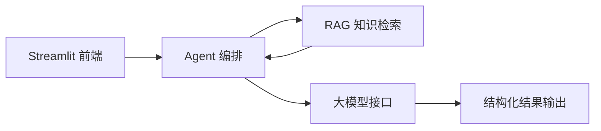

# 粤见非遗演示脚本

> 适用于比赛答辩、录屏演示、项目展示和 GitHub Demo 说明。

---

## 1. 演示目标

本次演示要让评委快速理解三件事：

1. **粤见非遗解决什么问题**  
   广东非遗资源丰富，但普通用户不知道如何理解、规划、记录和传播。

2. **粤见非遗不是普通问答机器人**  
   它可以完成“问答、路线、研学、文案、视频脚本”的任务闭环。

3. **粤见非遗具备技术支撑**  
   使用 Streamlit 前端、Agent 编排、RAG 本地知识库和结构化 Prompt 模板。

---

## 2. 3 分钟演示脚本

### 0:00 - 0:20 开场介绍

大家好，我们的项目是 **粤见非遗：广东非遗文化导游智能体**。

它面向游客、学生、亲子家庭和内容创作者。用户只需要输入城市、时间、身份和兴趣，就可以生成广东非遗路线、文化讲解、研学任务和传播文案。

一句话概括：

> 粤见非遗不是简单的问答机器人，而是一个把广东非遗知识转化为可执行成果的 AI 工作流引擎。

---

### 0:20 - 0:45 痛点说明

广东拥有粤剧、醒狮、广绣、龙舟、潮汕工夫茶、潮汕英歌舞等丰富非遗资源。

但是普通用户常遇到三个问题：

- 信息碎片化：要在很多平台之间反复搜索。
- 体验流于打卡：不知道看什么、怎么走、怎么看。
- 内容转化困难：学生缺研学任务卡，创作者缺文案和视频脚本。

所以我们希望用 AI 智能体把文化资料转化成路线、任务和内容。

---

### 0:45 - 1:30 Demo 一：广州一日非遗路线

在页面中选择：

```text
场景：游客路线
城市：广州
时间：一天
身份：外地游客
兴趣：非遗、拍照、研学
```

输入：

```text
我第一次来广州，有一天时间，想体验岭南非遗文化，最好适合拍照和写研学记录。
```

点击“生成方案”。

演示讲解要点：

系统会自动识别这是一个路线规划任务，并检索本地广东非遗知识库，生成一条广州岭南非遗路线。

预期输出包括：

- 路线主题
- 时间安排
- 陈家祠
- 广府早茶
- 粤剧艺术博物馆
- 永庆坊 / 西关街区
- 每站文化看点
- 拍照建议
- 研学记录建议

讲解重点：

> 这不是简单告诉用户“广州有什么景点”，而是把城市空间、非遗知识和用户身份结合起来，生成一份可以直接出发的文化体验方案。

---

### 1:30 - 2:05 Demo 二：学生研学任务

切换场景：

```text
场景：学生研学
```

输入：

```text
我是高中生，要做一份广东非遗研学报告，请帮我设计任务卡，主题围绕粤剧、醒狮和广绣。
```

预期输出：

- 研学主题
- 学习目标
- 行前准备
- 现场观察任务
- 采访问题
- 记录表模板
- 报告提纲

讲解重点：

> 系统把“去哪里看”进一步转化为“如何观察、如何记录、如何输出”，这正是研学场景的核心价值。

---

### 2:05 - 2:35 Demo 三：内容创作

切换场景：

```text
场景：内容创作
```

输入：

```text
帮我写一条介绍潮汕英歌舞的 60 秒短视频脚本，风格有画面感，适合抖音发布。
```

预期输出：

- 视频主题
- 开头 3 秒钩子
- 60 秒分镜脚本
- 旁白
- 拍摄建议
- 标题和标签

讲解重点：

> 系统可以把非遗知识转化为短视频内容，帮助年轻人用更熟悉的传播方式理解和分享岭南文化。

---

### 2:35 - 3:00 技术亮点与收尾

技术上，我们采用了：

- Streamlit 构建 Web 应用
- Agent 模块识别任务类型
- RAG 模块检索本地广东非遗知识库
- Prompt 模板控制不同任务的输出结构
- OpenAI 兼容接口接入大模型

最后总结：

> 粤见非遗希望让广东非遗从静态资料中走出来，进入真实的旅行、课堂和创作场景。  
> 得闲来玩，粤见非遗。

---

## 3. 5 分钟答辩脚本

### 0:00 - 0:40 项目定位

各位评委好，我们的项目叫 **粤见非遗**，Slogan 是“寻脉岭南，智游非遗”。

它是一个面向广东文旅导览、研学教育和城市文化传播的 AI 智能体。用户输入城市、时间、身份和兴趣后，系统可以自动生成非遗路线、文化讲解、研学任务和传播内容。

我们希望解决的问题是：广东非遗很多，但普通人不知道如何真正走近它、理解它和传播它。

---

### 0:40 - 1:20 痛点与解决方案

传统文旅体验中存在三个明显痛点：

| 痛点 | 表现 | 我们的解决方案 |
|---|---|---|
| 信息碎片化 | 搜索成本高，资料分散 | RAG 本地知识库整合广东非遗资料 |
| 体验表层化 | 用户不知道看什么 | 根据身份和兴趣生成路线与观察建议 |
| 内容转化难 | 学生和创作者缺输出模板 | 自动生成任务卡、报告提纲、文案和脚本 |

我们的核心不是“问答”，而是“任务完成”。

---

### 1:20 - 2:50 产品演示

按照 3 分钟演示脚本中的三个案例依次展示：

1. 广州一日非遗路线
2. 高中生研学任务卡
3. 潮汕英歌舞短视频脚本

讲解时强调：

- 用户输入很简单
- 输出结构很完整
- 结果可以直接使用
- 不同场景输出不同格式

---

### 2:50 - 3:50 技术架构

我们的系统分为四层：



核心文件包括：

- `app.py`：负责前端交互
- `agent.py`：负责任务识别和模型调用
- `rag.py`：负责本地知识库检索
- `prompts.py`：负责结构化输出模板
- `data/`：存放广东非遗知识、路线、研学和文案模板

---

### 3:50 - 4:35 创新价值

项目创新点有四个：

1. **文化定位清晰**  
   聚焦广东非遗和岭南文化，而不是泛泛的旅游助手。

2. **任务闭环完整**  
   覆盖问答、路线、研学、文案和短视频。

3. **RAG 降低幻觉**  
   通过本地知识库增强模型回答，减少泛化和编造。

4. **场景落地明确**  
   可服务游客、学生、亲子家庭、内容创作者和文旅机构。

---

### 4:35 - 5:00 未来规划

未来我们希望继续拓展：

- 接入地图 API，生成真实交通路线
- 接入语音合成，生成普通话和粤语导览
- 接入图片识别，识别醒狮、粤剧服饰和岭南建筑
- 扩展到更多广东城市和非遗项目
- 面向场馆和研学机构提供 To B 定制版本

结束语：

> 得闲来玩，粤见非遗。谢谢各位评委。

---

## 4. 演示输入合集

### 游客路线

```text
我第一次来广州，有一天时间，想体验岭南非遗文化，最好适合拍照和写研学记录。
```

### 学生研学

```text
我是高中生，要做一份广东非遗研学报告，请帮我设计任务卡，主题围绕粤剧、醒狮和广绣。
```

### 亲子体验

```text
我周末带孩子去佛山，想体验醒狮和石湾陶塑，节奏轻松一点，最好有互动任务。
```

### 内容创作

```text
帮我写一条介绍潮汕英歌舞的 60 秒短视频脚本，风格有画面感，适合抖音发布。
```

### 非遗问答

```text
醒狮、粤剧和广绣分别代表了广东什么文化？请用游客能听懂的方式解释。
```

---

## 5. 演示注意事项

1. 演示前确认 `.env` 或 Streamlit Secrets 已配置。
2. 建议提前运行一次，避免首次加载较慢。
3. 录屏时可以先展示首页，再直接进入生成区。
4. 如果模型回答较长，可以重点讲解前半部分结构。
5. 如果网络不稳定，建议准备一份截图或预生成结果作为备用。
