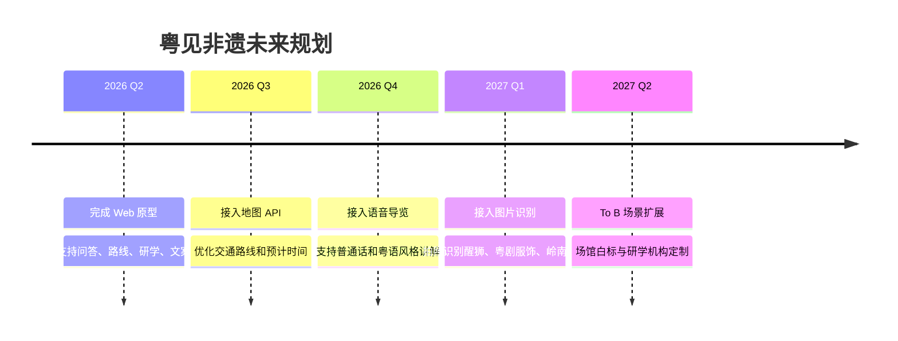

# 评委看点总结

> 本文件用于快速提炼“粤见非遗”的比赛亮点，适合答辩前复习，也适合放在 GitHub `docs/` 中增强项目完整度。

---

## 1. 项目一句话

**粤见非遗** 是一个面向广东文旅导览、研学教育与城市文化传播的 AI 智能体，通过 RAG 知识库和 Agent 工作流，把广东非遗知识转化为可执行路线、研学任务和传播内容。

---

## 2. 评委最应该看到的 5 个亮点

### 亮点一：广东特色明确

项目不是泛泛的旅游助手，而是聚焦广东非遗与岭南文化。

覆盖内容包括：

- 粤剧
- 醒狮
- 广绣
- 龙舟
- 潮汕工夫茶
- 潮汕英歌舞
- 佛山陶塑
- 客家围龙屋
- 香云纱
- 广东剪纸

这让项目具备明确地域辨识度和文化主题。

---

### 亮点二：不是普通问答，而是工作流引擎

普通问答机器人只能回答“是什么”。

粤见非遗可以完成：


核心闭环是：

```text
问、走、学、写、发
```

---

### 亮点三：RAG 知识库降低幻觉

项目通过 `data/` 文件夹构建本地知识库，包括：

- 非遗项目库
- 城市路线库
- 研学任务模板库
- 内容创作模板库
- 用户场景建议库
- 安全核验规则

系统会先检索本地知识，再让大模型生成答案，从而减少泛泛回答和事实编造。


---

### 亮点四：Prompt 工程保证输出稳定

不同任务使用不同 Prompt 模板：

| 任务 | Prompt 模板 | 输出 |
|---|---|---|
| 非遗问答 | `QA_PROMPT` | 一句话解释、文化背景、看点、体验建议 |
| 路线规划 | `ROUTE_PROMPT` | 时间安排、路线节点、拍照建议、注意事项 |
| 研学任务 | `STUDY_PROMPT` | 学习目标、观察任务、采访问题、报告提纲 |
| 图文文案 | `SOCIAL_PROMPT` | 标题、正文、配图建议、标签 |
| 短视频脚本 | `VIDEO_PROMPT` | 分镜、旁白、字幕、拍摄建议 |

这说明项目具备稳定的工程化输出能力，而不是随机聊天。

---

### 亮点五：落地场景清楚

项目可以服务多个真实场景：

| 场景 | 价值 |
|---|---|
| 游客导览 | 生成城市文化路线和体验建议 |
| 学生研学 | 生成任务卡、观察问题和报告提纲 |
| 亲子体验 | 生成轻松、有趣、安全的互动任务 |
| 内容创作 | 生成小红书文案和短视频脚本 |
| 场馆服务 | 辅助讲解、宣传和研学活动设计 |

---

## 3. 技术亮点表达

答辩时可以这样说：

> 我们采用 Streamlit 构建前端页面，通过 Agent 模块识别用户任务类型，再调用 RAG 模块从本地广东非遗知识库中检索相关内容，最后将检索结果和任务型 Prompt 一起发送给大模型，生成结构化结果。  
> 因此，它不是简单的大模型问答，而是一个具备任务路由、知识增强和格式约束能力的轻量级文化服务智能体。

---

## 4. 与传统搜索的区别

| 维度 | 传统搜索 | 粤见非遗 |
|---|---|---|
| 信息获取 | 用户自己找 | 系统自动整合 |
| 文化理解 | 用户自己判断 | 系统结构化讲解 |
| 路线规划 | 用户自己拼接 | 系统生成路线 |
| 研学输出 | 用户自己设计 | 系统生成任务卡 |
| 内容创作 | 用户自己写 | 系统生成文案和脚本 |
| 使用门槛 | 高 | 低 |

---

## 5. 与普通大模型聊天的区别

| 维度 | 普通聊天机器人 | 粤见非遗 |
|---|---|---|
| 知识来源 | 依赖模型泛化知识 | 接入本地广东非遗知识库 |
| 输出结构 | 不稳定 | 按任务模板输出 |
| 任务类型 | 用户反复提示 | 自动识别任务 |
| 场景适配 | 弱 | 游客、学生、亲子、创作者分场景 |
| 可展示性 | 像聊天 | 像产品工具 |

---

## 6. 社会价值

项目关注的不只是技术调用，也包括文化传播：

- 用 AI 降低年轻人接触非遗的门槛
- 让非遗进入旅行路线、课堂研学和社交媒体创作
- 帮助地方文化资源被重新发现和传播
- 为文旅场馆和研学机构提供轻量化智能工具原型

---

## 7. 商业模式潜力

| 模式 | 说明 |
|---|---|
| To C 免费体验 | 游客基础导览、文化问答 |
| To C 付费定制 | 深度路线、研学报告、内容创作包 |
| To B 场馆导览 | 为博物馆、非遗馆、城市展厅提供白标工具 |
| To B 研学机构 | 提供研学课程辅助和任务生成 |
| API 能力输出 | 将非遗问答和路线规划能力封装为接口 |

---

## 8. 未来升级方向



---

## 9. 答辩金句

可以在答辩中使用：

> 粤见非遗的核心不是“回答非遗是什么”，而是帮助用户完成“怎么走、怎么看、怎么学、怎么写、怎么传播”。

> 我们希望把广东非遗从静态资料转化为动态服务，让它进入真实的旅行、课堂和创作场景。

> 这个项目的技术价值在于：用 RAG 降低幻觉，用 Prompt 工程稳定输出，用 Agent 工作流连接真实用户任务。

> 得闲来玩，粤见非遗。

---

## 10. 评委可能提问与回答

### Q1：你们和普通旅游攻略有什么区别？

答：普通攻略主要提供静态信息，用户仍然需要自己筛选和规划。粤见非遗可以根据用户身份、时间、城市和兴趣自动生成路线、研学任务和传播内容，完成从信息到成果的转化。

---

### Q2：你们如何减少大模型幻觉？

答：我们使用本地 RAG 知识库，在生成前检索广东非遗项目、城市路线和任务模板，并将相关片段注入 Prompt。同时对开放时间、票价、预约等实时信息设置提醒，要求用户以官方平台为准。

---

### Q3：为什么说它是 Agent？

答：它具备任务识别、任务路由、知识检索、Prompt 选择和结构化输出能力。用户输入后，系统会判断是问答、路线、研学、图文还是视频脚本，并调用不同工作流生成结果。

---

### Q4：项目如何继续扩展？

答：可以从三个方向扩展：一是接入地图 API，增强真实路线能力；二是接入语音和图片识别，形成多模态导览；三是扩展 To B 场景，为场馆和研学机构提供定制版本。
