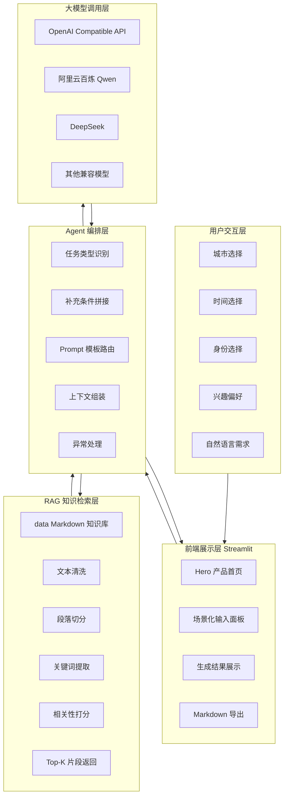
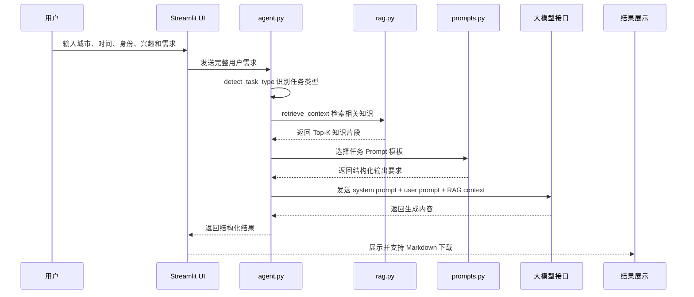
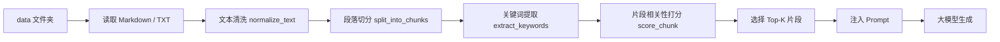
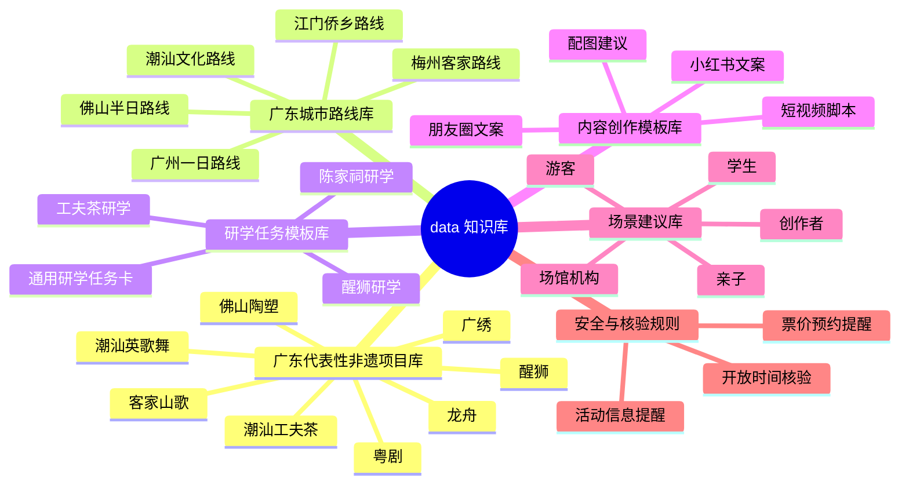
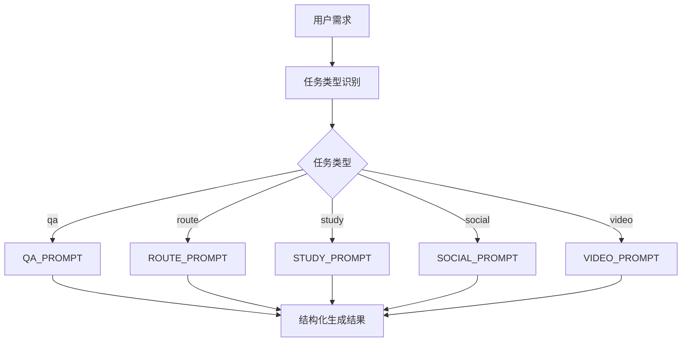
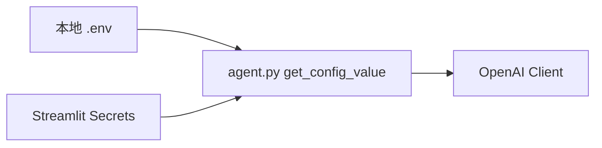

# 粤见非遗技术设计文档

> 本文档说明“粤见非遗”的系统架构、Agent 工作流、RAG 知识库设计、Prompt 工程和部署方案。

---

## 1. 技术目标

本项目的技术目标不是单纯调用大模型生成回答，而是构建一个具备任务识别、知识检索、Prompt 路由和结构化输出能力的轻量级 AI Agent。

核心目标：

1. **可运行**：使用 Streamlit 快速构建 Web 应用，降低体验门槛。
2. **可解释**：代码结构清晰，便于评委和开发者理解。
3. **可扩展**：知识库、Prompt 模板和模型接口均可替换或扩充。
4. **可落地**：输出结果直接服务文旅导览、研学任务和内容创作。
5. **可部署**：支持本地 `.env` 和 Streamlit Cloud `Secrets` 两种配置方式。

---

## 2. 总体架构



---

## 3. 文件职责

| 文件 / 文件夹 | 职责 |
|---|---|
| `app.py` | Streamlit 前端页面，负责 UI、用户输入、结果展示与导出 |
| `agent.py` | 智能体核心逻辑，负责任务识别、RAG 调用、Prompt 构造和模型调用 |
| `rag.py` | 本地知识库检索模块，负责读取、切分、检索 `data/` 文件 |
| `prompts.py` | Prompt 模板库，定义不同任务类型的输出格式 |
| `data/` | 给 AI 使用的广东非遗知识库、路线库、研学模板和文案模板 |
| `docs/` | 给人阅读的项目说明、技术设计、部署指南和演示脚本 |
| `.streamlit/config.toml` | Streamlit 页面配置，用于隐藏工具栏和设置主题 |
| `.env.example` | 本地模型接口配置示例 |
| `requirements.txt` | 项目依赖 |

---

## 4. Agent 工作流



---

## 5. 任务类型识别

系统通过关键词规则对用户需求进行轻量分类：

| 任务类型 | 触发关键词示例 | 输出方向 |
|---|---|---|
| `qa` | 是什么、为什么、介绍、解释、文化、历史 | 非遗知识问答 |
| `route` | 路线、规划、一日游、半日、怎么走、亲子 | 岭南文化路线 |
| `study` | 研学、任务卡、报告、观察任务、采访问题 | 研学任务工作流 |
| `social` | 小红书、朋友圈、文案、标题、标签、图文 | 图文传播内容 |
| `video` | 短视频、分镜、脚本、旁白、抖音、口播 | 短视频脚本 |

分类逻辑保持轻量，便于比赛展示和代码解释。后续可以升级为：

- 语义分类模型
- Few-shot intent classifier
- Function calling / tool calling
- 多 Agent 路由

---

## 6. RAG 知识库检索设计

### 6.1 为什么需要 RAG

通用大模型虽然具备常识能力，但容易出现：

- 泛泛而谈
- 与广东本地场景结合不够
- 编造开放时间、活动信息、路线细节
- 输出缺少研学与文旅可执行性

因此，本项目通过本地 `data/` 知识库进行检索增强，把广东非遗项目、城市路线、研学模板和内容模板注入模型上下文，降低幻觉风险，提高输出贴合度。

---

### 6.2 RAG 流程



---

### 6.3 知识库结构



---

## 7. Prompt 工程设计

项目将 Prompt 拆分为两层：

1. **System Prompt**：定义角色、边界、风格和安全规则。
2. **Task Prompt**：根据任务类型约束输出结构。

### 7.1 Prompt 路由



---

### 7.2 结构化输出示例

#### 路线规划输出

```yaml
route_output:
  title: "广州岭南非遗一日体验路线"
  target_user: "外地游客"
  schedule:
    - time: "上午"
      place: "陈家祠"
      focus: "岭南建筑、灰塑、广绣"
      advice: "适合观察建筑装饰与拍照"
    - time: "下午"
      place: "粤剧艺术博物馆"
      focus: "粤剧服饰、唱腔、舞台"
      advice: "适合研学记录"
  reminder: "开放时间、票价和预约信息请以官方平台为准"
```

#### 研学任务输出

```yaml
study_output:
  theme: "从陈家祠看岭南建筑装饰与广府审美"
  goals:
    - "认识灰塑、砖雕、木雕等岭南建筑装饰"
    - "理解建筑装饰与地方审美之间的关系"
  tasks:
    - "观察三处屋脊装饰并记录题材"
    - "选择一种纹样分析其吉祥寓意"
  report_outline:
    - "研学背景"
    - "观察对象"
    - "现场记录"
    - "文化分析"
    - "保护与传播建议"
```

---

## 8. 模型接口设计

项目使用 OpenAI Compatible API，便于兼容不同大模型平台。

| 平台 | `OPENAI_BASE_URL` | `MODEL_NAME` 示例 |
|---|---|---|
| 阿里云百炼 Qwen | `https://dashscope.aliyuncs.com/compatible-mode/v1` | `qwen-plus` / `qwen-turbo` |
| DeepSeek | `https://api.deepseek.com` | `deepseek-chat` |
| OpenAI | `https://api.openai.com/v1` | `gpt-4o-mini` |

配置读取优先级：



---

## 9. 部署与安全

### 9.1 本地运行

本地使用 `.env` 管理 API Key。

```env
OPENAI_API_KEY=你的API_KEY
OPENAI_BASE_URL=https://dashscope.aliyuncs.com/compatible-mode/v1
MODEL_NAME=qwen-plus
```

### 9.2 云端部署

Streamlit Cloud 使用 Secrets 管理 API Key。

```toml
OPENAI_API_KEY = "你的API_KEY"
OPENAI_BASE_URL = "https://dashscope.aliyuncs.com/compatible-mode/v1"
MODEL_NAME = "qwen-plus"
```

### 9.3 安全规则

`.gitignore` 必须包含：

```gitignore
.env
.streamlit/secrets.toml
__pycache__/
*.pyc
```

`.env` 不应上传 GitHub。

---

## 10. 当前技术特点

| 方向 | 当前实现 | 优点 |
|---|---|---|
| 前端 | Streamlit | 快速、轻量、易部署 |
| RAG | 本地 Markdown + 关键词检索 | 无额外依赖，便于解释和展示 |
| Agent | 规则任务识别 + Prompt 路由 | 简洁稳定，适合比赛原型 |
| 模型 | OpenAI Compatible API | 可接入多个模型平台 |
| 输出 | Markdown | 易复制、易导出、易提交 |

---

## 11. 后续技术升级

| 方向 | 升级方案 |
|---|---|
| 检索能力 | 引入 Embedding、向量数据库、BM25 + 向量混合检索 |
| 路线规划 | 接入地图 API，返回交通时间和真实路线 |
| 多模态 | 接入图片识别，支持拍照识别醒狮、粤剧服饰、岭南建筑 |
| 语音导览 | 接入 TTS，生成普通话 / 粤语导览音频 |
| Agent 能力 | 使用 Tool Calling，让路线、检索、生成分别由工具执行 |
| 数据维护 | 建立结构化 JSON/YAML 知识库，便于长期更新 |
| 评估体系 | 建立回答准确性、完整性、可执行性评分指标 |

---

## 12. 技术总结

“粤见非遗”的技术方案强调轻量、清晰、可复现。

它通过：

- Streamlit 构建用户交互
- Agent 进行任务识别与编排
- RAG 检索增强本地广东非遗知识
- Prompt 工程约束结构化输出
- OpenAI 兼容接口调用大模型

实现了从“用户需求”到“文化路线、研学任务、传播内容”的自动化生成闭环。
